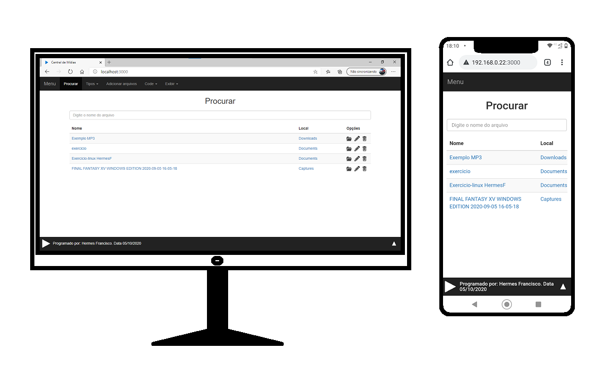

# Central de Midias 2.0

Software para organização e compartilhamento de mídias.



## Pré requesitos

É necessário ter previamente instalado em sua máquina os seguintes softwares.

  - [MySQL](https://www.mysql.com/downloads/) 
  - [Node](https://nodejs.org/en/download/)

por isso, recomendo que você instale o [Laragon](https://laragon.org/download/) completo.

Durante a instalação do Laragon, deixe marcada a opção "Add Notepad++ & Terminal to the right-click menu"
e, após instalar e iniciar o Laragon, clique em "Iniciar tudo", ou "Start" - isso irá iniciar o MySql.

Depois disso, você poderá iniciar o terminal ao clicar com o botão direito na pasta onde o software estiver.

Na segunda vez que você precisar iniciar o MySql, que é necessário para o software, você poderá executar o arquivo ```sql.bat``` pelo Terminal.

## Como instalar
Para iniciar o software, primeiro é necessário instalar suas dependências.

Descompacte os arquivos e, logo em seguida, entre no diretório onde estão os arquivos pelo terminal 
e execute o comando ```npm install```.


Após estes passos, para iniciar o software, execute o comando abaixo:

```shell
npm start
```
(É necessário executar esse comando duas vezes apenas na primeira inicialização)

O seu navegador ira abrir o seguinte endereço:
http://localhost:3000


**Para informações de como utilizar o sistema, abra o [Manual da Central de Mídias](./manual/Manual.md)**
**o manual está incompleto, por enquanto**