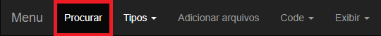
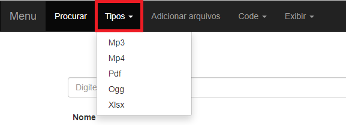
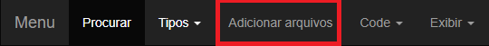
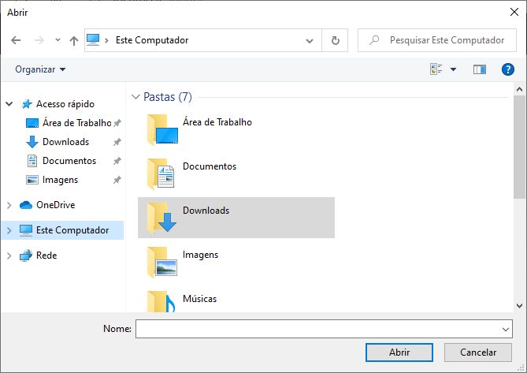
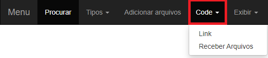
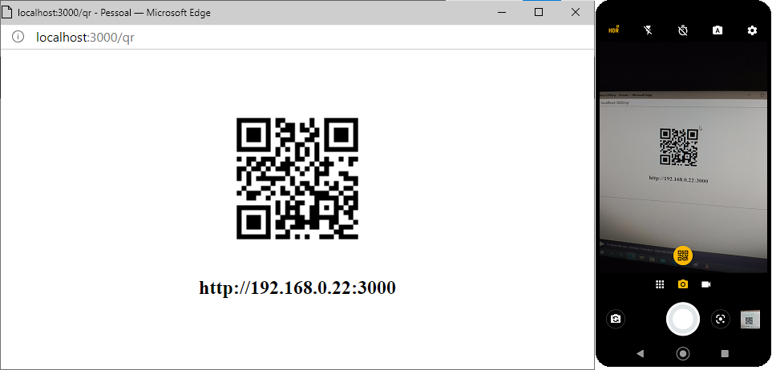
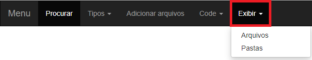
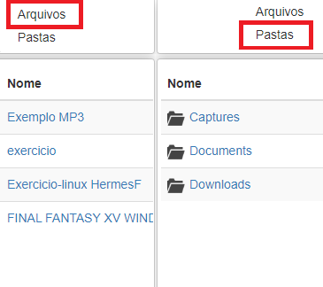

# Menu Principal

Em dispositivos móveis (ou em janelas pequenas), o Menu Principal ficará oculto por padrão - para exibí-lo, basta tocar (ou clicar) em "Menu"

## Procurar

O botão "procurar" volta para a lista completa de arquivos (que também possui a barra de pesquisa).

 

## Tipos

Lista os tipos dos arquivos registrados - por padrão, essa lista inclui os tipos Mp3, Mp4, Pdf e Ogg, independentemente se há arquivos registrados desses tipos ou não, enquanto os outros tipos só se mantém na lista enquanto houver arquivos deles.

Ao clicar em um dos tipos, o sistema irá mostrar apenas os arquivos registrados daquele tipo, ou pastas que possuam arquivos daquele tipo (ver [Exibir](#exibir)).

 

## Adicionar Arquivos

**Função exclusiva do servidor do sistema - ela é inacessível a outros dispositivos ligados à rede**

Abre uma janela para que os arquivos a serem registrados e compartilhados pelo sistema sejam selecionados.

Há ocasiões em que essa janela não aparece, mesmo estando aberta - caso ela demore muito para aparecer, minimize a janela de seu navegador (ela pode ter aparecido em segundo plano).

Para que o arquivo adicionado apareça na lista, é necessário recarregar a página

 

## Code

**Função exclusiva do servidor do sistema**

Gera e exibe um QR Code contendo um link para que o sistema possa ser acessado através do celular (mostrando, também, o URL para que o sistema possa ser acessado através de outro computador), ou para enviar arquivos para o servidor (ver [Receber Arquivos](./upload.md))

 

## Exibir

Muda o modo de exibição da lista - o modo "Arquivos" (modo de exibição padrão) lista todos os arquivos registrados no sistema, enquanto o modo "Pastas", separa os arquivos pelas pastas que os contém.

